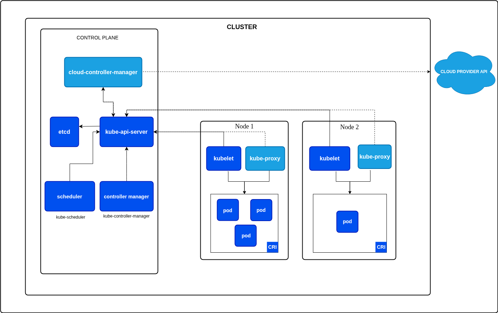

# Kubernetes

Kubernetes (often called **K8s**) is an open-source platform for **automating deployment, scaling, and management of containerized applications**.  
It provides a powerful, declarative API so you can describe the desired state of your workloads and let the system maintain it.

---

## Overview

* **Container Orchestration** – schedules and runs containers across a cluster of machines.
* **Declarative Configuration** – you describe the desired state (e.g., “3 replicas”) and Kubernetes continuously works to match it.
* **Self-Healing** – automatically restarts or reschedules failed containers.
* **Horizontal Scaling** – add or remove pods seamlessly based on demand.

---

## Architecture

The diagram below shows the main components of a Kubernetes cluster:

**Key Pieces**

### Control Plane
The control plane manages the entire cluster and keeps the system’s desired state.

| Component            | Role |
|----------------------|-------------------------------------------------------------|
| **API Server**       | Central management entrypoint; validates and processes requests. |
| **Scheduler**        | Chooses which node should run a new pod. |
| **Controller Manager**| Ensures the cluster matches the declared state (replicas, endpoints, etc.). |
| **etcd**             | Highly available key–value store holding cluster configuration and state. |

---

### Worker Nodes
Worker nodes run your actual workloads (containers/pods).

| Component            | Role |
|----------------------|-------------------------------------------------------------|
| **Kubelet**          | Agent on each node that talks to the API server and manages pods. |
| **Kube-Proxy**       | Maintains networking rules and handles service discovery/load-balancing. |
| **Container Runtime**| Software (e.g., containerd, CRI-O) that runs the containers. |

